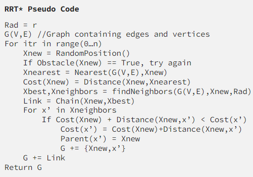
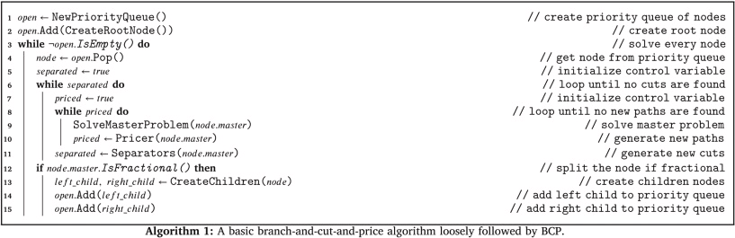

# Proposal 
We are interested in the Fast-RRT(Rapidly exploring Random Trees); Multi-Agent Path Finding algorithm; and maybe A* pathfinding algorithm. Fast-RRt is an improved algorithm for RRT which is an algorithm designed to make connections between a randomly spawned node (X_rand) in the state space and a node in a tree that is closest to X_Rand. The multi-agent path finding algorithm is an approach to efficiently find collision free paths for multiple agents. The A* pathfinding algorithm is a heuristic based technique to efficiently find the hottest path between two points by systematically exploring and evaluating paths based on their cost and an estimated distance to the goal. These algorithms should help us find our paths fast and efficiently. We will apply our algorithms to the METAL data in the state of Florida. 

## Fast-RRT


## A*
```python
// A* Search Algorithm
1.  Initialize the open list
2.  Initialize the closed list
    put the starting node on the open 
    list (you can leave its f at zero)
3.  while the open list is not empty
    a) find the node with the least f on 
       the open list, call it "q"
    b) pop q off the open list
  
    c) generate q's 8 successors and set their 
       parents to q
   
    d) for each successor
        i) if successor is the goal, stop search
        
        ii) else, compute both g and h for successor
          successor.g = q.g + distance between 
                              successor and q
          successor.h = distance from goal to 
          successor (This can be done using many 
          ways, we will discuss three heuristics- 
          Manhattan, Diagonal and Euclidean 
          Heuristics)
          
          successor.f = successor.g + successor.h
        iii) if a node with the same position as 
            successor is in the OPEN list which has a 
           lower f than successor, skip this successor
        iV) if a node with the same position as 
            successor  is in the CLOSED list which has
            a lower f than successor, skip this successor
            otherwise, add  the node to the open list
     end (for loop)
  
    e) push q on the closed list
    end (while loop)
```

## Multi-Agent
](images/image.png)
